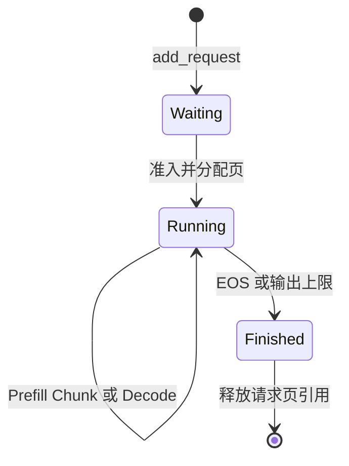

# 第 2 节：把单请求生成循环变成多请求推理引擎

上一节：[生成与 KV](01_generation_and_kv.md) · [目录](README.md) · 下一节：[分页与 Packed](03_pages_and_packed.md)

这一节暂时把模型视为黑盒：给它本轮输入，它返回采样 Token 或“还不能采样”的标记。
重点是理解模型外面的状态，而不是进一步优化 Attention。

## 1. DataLoader 的 Batch 与请求 Batch 有什么区别

你熟悉的训练 Batch 通常先组好，再执行 forward/backward。一个生成请求却可能存活很多轮，
并且每个请求的 Prompt 长度、输出长度、到达时间和结束时间都不同。

如果先把 A/B/C 组为固定 Batch，必须等整个 Batch 全部结束再加入 D，就可能让已结束请求的
位置闲置。Continuous Batching（连续批处理）允许在轮与轮之间移除已结束请求、接纳新请求。

```text
某轮参与者：A、B
A 本轮结束，C 到达
下一轮参与者：B、C
```

它描述请求参与集合可以变化，不表示请求在一个 CUDA Kernel 执行一半时插进来；也不要求
每个请求对应一个 Python 线程。本项目的 CPU Scheduler 在 step 边界决定下一轮工作。

## 2. 为什么需要 Sequence

一个普通 Tensor 只能保存 Token ID，不足以回答它属于谁、哪些位置已经计算、什么时候停止。
因此项目把这些信息集中在 [Sequence](../../mini_vllm/sequence.hpp#L21)：

```cpp
std::uint64_t request_id_;
std::vector<int> token_ids_;
std::size_t num_prompt_tokens_;
std::size_t num_computed_tokens_ = 0;
SamplingParams sampling_params_;
SequenceStatus status_ = SequenceStatus::Waiting;
std::vector<int> block_table_;
```

对应一个 Python 状态对象的教学写法：

```python
# 仅解释字段，不是另一个要部署的调度器。
request = dict(
    id=1, tokens=[10, 20, 30, 40, 50], prompt_len=5,
    computed=0, max_new_tokens=3, status="waiting", block_table=[]
)
pending = len(request["tokens"]) - request["computed"]
```

`num_tokens` 是已经存在的 Token 数；`computed` 是已经跑过模型、写好 KV 的 Token 数。
两者有差值恰恰是正常情况：刚采样出来的一个 Token 尚未作为输入。

## 3. 同一个请求的两种状态不要混在一起

状态枚举 Waiting/Running/Finished 表示调度生命周期；Prefill/Decode 表示计算进度。

```cpp
bool is_prefill() const {
    return num_computed_tokens_ < num_prompt_tokens_;
}
```



一个 Running 请求仍可能处于尚未完成的 Prefill Chunk。不要看到 `running_` 就认为里面全是
Decode。这也解释了为什么本项目“优先推进 Running”不等于“严格把所有 Decode 排到所有
Prefill 前面”。Running 内按现有顺序遍历，长 Prefill 也会消耗预算。

查代码时先看：

| 问题 | 代码生产者 | 使用者 |
| --- | --- | --- |
| 请求何时创建 | [Engine::add_request](../../mini_vllm/cuda/gpt2_cuda_engine.hpp#L46) | `Scheduler::add` 放入 Waiting |
| 何时成为 Running | [Scheduler::schedule](../../mini_vllm/scheduler.hpp#L56) 的 Waiting 准入分支 | 下一轮 running_ 遍历 |
| 当前什么阶段 | `Sequence::is_prefill` | `Scheduler::try_schedule` 构造 ScheduledItem |
| 何时结束 | `Sequence::should_finish_after` | `Scheduler::commit` |

## 4. Scheduler 决定的是“本轮执行多少 Token”

[SchedulerOutput](../../mini_vllm/scheduler.hpp#L21) 不包含神经网络输出，内容是本轮执行计划：

```cpp
struct ScheduledItem {
    std::shared_ptr<Sequence> sequence;
    ExecutionPhase phase;
    std::size_t num_scheduled_tokens;
};
struct SchedulerOutput {
    std::vector<ScheduledItem> items;
    std::size_t num_batched_tokens;
};
```

例如 `{A:1, B:7}` 表示 A 执行一个待处理 Token，B 执行七个；它不是说 A 生成 1 个、B 生成
7 个输出。B 可能还没有完成 Prompt，因此本轮一个输出也没有。

两个配置限制不同维度：

- `max_num_sequences`：同时 Running 的请求数上限。
- `max_num_batched_tokens`：本轮所有请求实际输入 Token 数的和的上限。

预算代码在 `try_schedule`：

```cpp
const std::size_t budget = config_.max_num_batched_tokens - output.num_batched_tokens;
const std::size_t count = std::min(sequence->pending_tokens(), budget);
const std::size_t target = sequence->num_computed_tokens() + count;
if (!block_manager_.ensure_capacity(*sequence, target)) return false;
```

先按预算确定本轮位置范围，再为这些位置保证有 KV 页。`count` 小于剩余 Prompt 长度，就形成
Chunked Prefill。拆 Chunk 不改变本请求的绝对位置，不意味着不同 Chunk 互相看不到历史。

## 5. schedule / run / commit 为什么分开

真实 Engine 的核心调用：

```cpp
SchedulerOutput output = scheduler_.schedule();
result.sampled_token_ids = model_runner_.run(output);
scheduler_.commit(output, result.sampled_token_ids);
```

这三个函数回答不同问题：

| 函数 | 做什么 | 返回或改变什么 |
| --- | --- | --- |
| schedule | 选择请求、执行数，保证页容量 | 本轮计划；也可能改变队列/分配状态 |
| run | 根据计划执行模型与采样 | 与 items 平行的样本数组 |
| commit | 确认哪些输入算完，追加输出、判断结束 | 计算计数、Token 列表、队列与页引用 |

schedule 不是纯函数，也不是一次执行就一定完成请求。模型运行中断时还需要更完整的恢复设计，
本项目在出错时报告异常，未实现服务级重试事务。

commit 中先 `mark_computed(count)`，若仍有 pending，就要求样本标记为 -1：

```cpp
sequence.mark_computed(item.num_scheduled_tokens);
if (sequence.pending_tokens() != 0) {
    if (sampled_token_ids[i] != -1) throw std::logic_error(...);
    continue;
}
sequence.append_token(sampled_token_ids[i]);
```

这段简写省略了 Prefix Cache 注册与结束判断。-1 是控制协议，表示 Chunk 未完成，不是词表中的
一个 Token。默认裁剪路径也会跳过这些请求的 LM Head，最终返回的数组仍与请求一一对应。

## 6. 手推真实 demo：不要先跳到 CUDA

源码：[mini_vllm/demo.cpp](../../mini_vllm/demo.cpp)。这里使用的 Page Size=4，仅用于控制面教学；
CUDA 正式 Kernel 的 Page Size=16。

```cpp
BlockManager block_manager(12, 4);
Scheduler scheduler({3, 8}, block_manager);
scheduler.add(make_request(1, 6, 3));   // A：Prompt 6，输出 3
scheduler.add(make_request(2, 11, 2));  // B：Prompt 11，输出 2
// 第 3 轮开始加入 C：Prompt 3，输出 2
```

每轮样本是 demo 按 request_id 构造的确定性假 Token。它检验的是调度，不证明模型精度。
把假模型替换为 `GPT2CudaModelRunner::run` 后，外层协议不变。

先看四轮计划与样本，再看计数：

| 轮 | 本轮真实输入计划 | 本轮样本数组 | 说明 |
| --- | --- | --- | --- |
| 1 | A Prefill 6；B Prefill 2 | `[1010,-1]` | 用满 8 Token，B 仍有 9 Prompt Token 未算 |
| 2 | A Decode 1；B Prefill 7 | `[1011,-1]` | A 再生成一个，B 尚剩 2 |
| 3 | A Decode 1；B Prefill 2；C Prefill 3 | `[1012,1020,1030]` | A 完成，B/C 各得首 Token |
| 4 | B Decode 1；C Decode 1 | `[1021,1031]` | B/C 完成，全部页回收 |

下面每个单元格为 `computed / num_tokens / 输出数`，均为 commit **之后**：

| 轮 | A | B | C |
| --- | --- | --- | --- |
| 创建后 | 0 / 6 / 0 | 0 / 11 / 0 | 尚未到达 |
| 1 | 6 / 7 / 1 | 2 / 11 / 0 | 尚未到达 |
| 2 | 7 / 8 / 2 | 9 / 11 / 0 | 尚未到达 |
| 3 | 8 / 9 / 3，结束 | 11 / 12 / 1 | 3 / 4 / 1 |
| 4 | 已结束 | 12 / 13 / 2，结束 | 4 / 5 / 2，结束 |

请求结束时仍可能 `pending=1`。最后一个 Token 已作为输出交给用户，不再要求计算它的 KV。
Completed 状态才是停止依据，不能强制把 computed 补成所有输出 Token 数。

## 7. 把每页容量也算一遍

该 demo 关闭 Prefix Cache，没有共享页。每页可存 4 Token，需要页数是 `ceil(computed/4)`，
但必须区分本轮分配前、模型执行前和 commit 后：

| 轮 | 本轮容量保证后的页数 A/B/C | 执行前空闲页 | commit 后空闲页 |
| --- | --- | ---: | ---: |
| 1 | 2 / 1 / 0 | 9 | 9 |
| 2 | 2 / 3 / 0 | 7 | 7 |
| 3 | 2 / 3 / 1 | 6 | 8（A 释放 2 页） |
| 4 | 0 / 3 / 1 | 8 | 12（B/C 全释放） |

A 第 3 轮输出后共 9 Token，却只需 2 页，因为仅前 8 个输入产生了 KV，第 9 个是最后输出。
这就是为什么不能只按 token_ids.size() 推断当轮已使用的 KV。

运行并核对：

```bash
c++ -std=c++17 -O0 -g -gdwarf-4 -I. mini_vllm/demo.cpp -o /tmp/zyf_learning_demo
/tmp/zyf_learning_demo
```

输出的 `free_blocks_before` 实际位于 `schedule()` 之后，是**模型执行前**的空闲页数，不是
调用 schedule 之前的数。读日志时必须查打印点，不能只猜字段名字。

## 8. 为什么不一次接纳所有请求

未开始的请求主要占 CPU 状态；Running 请求需要 KV 页和本轮预算。显存不足时盲目接纳会让
多个请求都持有部分历史，却一起无法继续扩页。常见处理包括等待、抢占后重算等，但它们需要
明确的策略。

本项目单卡 Scheduler 在无法分配时尝试推进其他现有工作；如果整轮没有任何工作，Engine 会
报错，未实现抢占。不能据“单次分配失败不留下半张页表”推断它能自动处理所有超量并发。
双卡 PD 则采用 D 端预留输出上限和有界背压，细节在任务 11。

验证对应函数：[test_oom_is_atomic_and_eos_releases_blocks](../../dev/test_mini_vllm_control_plane.cpp)、
`test_continuous_admission_and_retirement`、`test_chunked_prefill`。

## 9. 过关任务

不看表格，解释 demo 第二轮为何 B 得到 7 个输入额度却没有输出。再在第三轮添加断点，找到：

1. C 从 Waiting 变成 Running 的位置。
2. A 追加最后一个 Token 的位置。
3. A 页引用归零、进入空闲队列的位置。

下一节会把这里的“页”变成具体 Tensor 地址，并解释多个请求怎么进入同一个 GPU GEMM。
