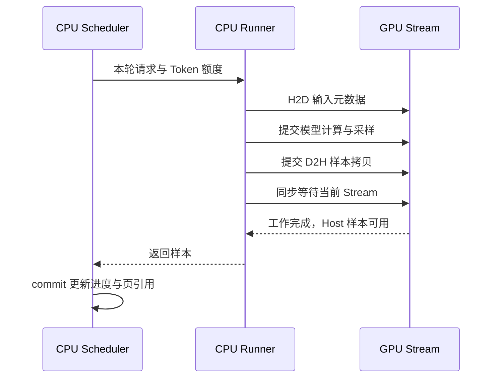

# 第 4 节：用 PyTorch 框架经验读懂 CUDA Runner

上一节：[分页与 Packed](03_pages_and_packed.md) · [目录](README.md) · 下一节：[nano-vLLM 对照](05_read_nanovllm_and_vllm.md)

现在你已经知道本轮要算哪些 Token，以及历史 KV 在哪里。接下来才进入模型执行面。
本节不要求你一开始就掌握 cuBLAS 全部 API，而是把每个调用放回熟悉的 PyTorch 语义。

## 1. 你熟悉的链路位于哪里

对于基于 PyTorch 的推理实现，可以按下面的层次理解：

```text
请求/调度/缓存管理
    ↓ 决定本轮输入与历史状态
模型 Module.forward
    ↓ eager 算子，或选择的编译执行路径
ATen / 后端分发 / 库调用 / 自定义算子
    ↓
GPU Kernel 与 Stream
```

本项目的 C++/CUDA Runner 已手工实现模型前向，直接调用 CUDA Kernel 和 cuBLAS，不会在
每个 step 里重新经过 TorchDynamo、FX、Inductor 或 PyTorch Dispatcher。你可以用那些知识
理解算子职责和性能，但不要在这个独立可执行程序里找 `torch.compile` 捕获点。

“模型前向一次很快”与“引擎处理一批请求很快”之间，还隔着调度、输入构造、元数据搬运、
采样和同步。Profiler 分析时要同时看这两层。

## 2. 先把 Module 运算翻译成函数名

文件：[gpt2_cuda_model_runner.cu](../../mini_vllm/cuda/gpt2_cuda_model_runner.cu)。
下面列的函数名可直接用 `rg -n` 搜索。

| 熟悉的 PyTorch 表达式 | 项目对应函数 | 在 forward 的哪个调用点 |
| --- | --- | --- |
| `wte[token] + wpe[position]` | `embedding_kernel` | 层循环前 |
| `F.layer_norm(x, ...)` | `layernorm_kernel` | 每层 LN1、LN2 和最终 LN |
| `F.linear(x, w_qkv, b_qkv)` | `matmul` + `add_bias_kernel`/half2 | LN1 后 |
| `qkv.chunk(3, -1)` | `split_qkv_kernel` | QKV GEMM 后 |
| 把新 K/V 写入缓存 | `write_kv_cache_kernel`，在 paged_attention.cu | Attention 封装内部首先执行 |
| 分页历史上的 Attention | `paged_attention_kernel` | 写 KV 后 |
| `x + attention_projection` | `residual_kernel` 或 half2 | Attention Projection 后 |
| `Linear → GELU → Linear` | `matmul → gelu_kernel → matmul` | LN2 后 |
| `hidden[sample_rows]` | `gather_sample_rows_kernel` | Final LN 后 |
| `F.linear(selected, wte)` | `logits_matmul` | Gather 后 |
| `logits.argmax(-1)` | `argmax_kernel` | LM Head 后 |

不要第一次就同时读精度和 Fusion 分支。先用 FP32、Fusion 关闭、Graph 关闭的路径跟完上述
顺序，再看 FP16、half2 和融合如何改变实现。

## 3. 权重和激活的形状对应

以 GPT-2 124M 的 MHA 为例：C=768，H=12，D=64。N 是本轮 Packed Token 行数。

| 步骤 | 输入 | 权重布局/输出 |
| --- | --- | --- |
| LN1 | `[N,768]` | 输出 `[N,768]`，归一化维度为 C |
| QKV 投影 | `[N,768]` | 权重 `[2304,768]`，输出 `[N,2304]` |
| Split | `[N,2304]` | Q/K/V 各 `[N,768]`，语义上可看作 `[N,12,64]` |
| Attention | 每行 Q + 分页历史 K/V | 输出 `[N,768]` |
| FC | `[N,768]` | 输出 `[N,3072]` |
| GELU + 投影 | `[N,3072]` | 输出 `[N,768]` |
| 最终采样行 | `[N,768]` | Gather 为 `[R,768]` |
| LM Head | `[R,768]` | 输出 `[R,50304]`，只在前 50257 维做有效词表 Argmax |

有些项目会把 Q/K/V 组织成四维或采用不同布局，数学语义相同不意味着裸内存可直接互换。
这一点在读 nano-vLLM 的缓存布局和本项目 PD 拷贝时尤其要注意。

## 4. cuBLAS 的转置标志为什么不等于模型数学换了

PyTorch 的 Linear 可以写成：

```python
y = x @ weight.T + bias    # x:[N,C]，weight:[O,C]，y:[N,O]
```

当前 CUDA `matmul` 中，FP32 分支调用：

```cpp
cublasSgemm(
    cublas_.get(), CUBLAS_OP_T, CUBLAS_OP_N,
    output_width, batch_size, input_width, &alpha,
    weight, input_width, input, input_width, &beta,
    output, output_width);
```

cuBLAS 这个接口以列主序解释内存，而本项目权重和激活从 C++ 侧按行主序保存。同一块
row-major `[N,C]` 内存，可以解释为 column-major `[C,N]`，因此这里计算的列主序输出是
`[O,N]`，内存从 C++ 侧看正是 `[N,O]`。`m=O,n=N,k=C`，不是把用户 Batch 语义改成 O。

看这段代码时先写出三个矩阵形状，再理解转置标志；不要单靠变量名猜 lda/ldb/ldc。
FP16/BF16 分支使用 `cublasGemmEx`，核心布局逻辑相同。

## 5. 一次 Engine.step 的真实 CPU/GPU 边界

```text
CPU：schedule → 准备 token/position/context/slot/table/sample_rows
    ↓ H2D（Host to Device）
GPU：Embedding → 12 层模型 → Final LN → Gather → LM Head → Argmax
    ↓ D2H（Device to Host，只传样本 ID）
CPU：等待本轮 Stream 完成 → commit → 下一轮调度
```



生产者和调用点：

| 边界 | 生产者 | 消费者 | 观察入口 |
| --- | --- | --- | --- |
| 请求到执行计划 | `Scheduler::schedule` | Runner::run | ScheduledOutput.items |
| CPU 状态到紧凑数组 | `prepare_packed_model_input` | `forward<T>` | `last_model_inputs()` |
| Host 数组到设备缓冲 | `copy_metadata` | 各 Kernel | `last_host_to_device_bytes()` |
| GPU logits 到样本 | `argmax_kernel` | D2H 拷贝 | Runner::run 返回值 |
| 样本到请求 | Runner::run | Scheduler::commit | token_ids、computed、status |

`cudaMemcpyAsync` 这个名字不保证所有情况下 Host 立即返回。普通 std::vector 内存并非 pinned，
运行时可能进行内部 staging 或同步。学习本项目时先依赖代码明确建立的 Stream 顺序，而不是
仅凭函数名字推断传输和计算已经重叠。

## 6. 看懂“持久 Buffer”

PyTorch 通常由 Tensor 持有 Storage。这个 Runner 使用 `DeviceBuffer`、`DeviceTensorBuffer`
等 RAII 类持有设备指针：构造分配，析构释放。权重、KV Pool 和激活在 Runner 生命周期内复用，
每一轮覆盖相应区域。

```cpp
// 在 Impl 构造函数的初始化列表里：
key_cache_(cache_elements(), storage_size()),
value_cache_(cache_elements(), storage_size())
```

这与 BlockManager 的“分配页”是两个层次：前者分配整块显存，后者管理它内部的页号。
同样，`shared_ptr<Sequence>` 管 CPU 请求对象生命期，`Block.ref_count` 管 KV 页共享引用，二者
不是同一个引用计数。

调试打印 `last_logits_for_testing()` 会额外把 logits 拷回 CPU，是验证接口；正常生成只回传
样本 ID，不要在计时窗口每轮调用这个调试接口。

## 7. 四种容易混为一谈的“缓存/图”

| 名称 | 缓存或描述的内容 | 何时复用 | 本项目相关位置 |
| --- | --- | --- | --- |
| KV Cache | 模型运行产生的历史 K/V 数值 | 同请求下一步 | KV Pool / PagedAttention |
| Prefix Cache | 前缀身份到可复用 KV 页的映射 | 新请求前缀相同 | BlockManager |
| FX/Inductor 编译图与代码缓存 | 运算关系及生成程序 | 满足编译专门化条件时 | 本独立 Runner 未经该链路 |
| CUDA Graph | 一组已记录的 GPU 操作及依赖 | 满足捕获形状与地址约束时 | `cuda_graphs_`、`graph_key` |

图编译与 CUDA Graph 可以在某些系统中组合，但概念不同。修改 Token 值通常不改变计算拓扑，
却可能改变 Prefix Cache 的 Key。反之，相同前缀可以命中 KV，但本轮 N/R 改变，可能需要另一张
CUDA Graph。这就是两套缓存不能混用的具体例子。

## 8. 用任务 09 的例子理解 CUDA Graph

同一个 Runner 保持权重、dtype、最大容量和设备地址固定。Graph Key 是：

```cpp
const auto graph_key = std::make_pair(batch_size, num_logit_rows);
```

N 控制模型主干形状，R 控制 Gather/LM Head/Argmax 形状。新的 Token 和页表数据先写到固定设备
地址，再 Replay 图；不用因为 Token 值不同就重新捕获。

一个 `(N=4,R=1)` 的图今天采样行 3，下一轮可采样行 1，前提是图外更新了 sample_rows 数组。
反之 `(4,0)` 跳过 LM Head，不能重用 `(4,1)` 的执行拓扑。

本项目捕获的是 GPU 计算链路。C++ 的调度、队列、KV 引用计数和 PD 状态交接仍在 Host 执行，
不会因为启用 Graph 就自动消失。

## 9. PagedAttention 与 FlashAttention 是两个问题维度

分页主要处理动态 KV 的存储与共享；FlashAttention 主要通过分块组织计算和访存，减少
Attention 计算中的内存 IO。二者可以组合，不应把“用了分页”当成“已经实现 FlashAttention”。
可对照 [PagedAttention 原论文](https://arxiv.org/abs/2309.06180) 与
[FlashAttention 原论文](https://arxiv.org/abs/2205.14135)。

本项目 CUDA Attention 是教学实现，按 Token/Head 遍历历史页；本地 nano-vLLM 调用了
FlashAttention 接口。学习时先确认两边的 Q/K/V、页表和可见长度语义，再研究内核性能差异。

## 10. 用你熟悉的调试思路定位问题

假设输出错误，可以按 first-divergence 的思路分层排查：

| 现象 | 先比较什么 | 看哪里的代码 |
| --- | --- | --- |
| 新请求首 Token 就错 | Token/Position 是否正确，完整前缀 logits | ModelInput → Embedding → 完整模型参考 |
| 第 16→17 个位置开始错 | 页分配和跨页 Slot | ensure_capacity → slot_mapping |
| 混合 Batch 才错 | Packed 边界与请求映射 | query_start_locations、scheduled_item_indices |
| 开 Graph 后错 | 缓存 Key、动态数组更新、固定地址 | copy_metadata → graph_key → Launch |
| Prefix 命中才错 | Key、共享页和 computed | apply_prefix_cache → 真实 GPU KV |
| PD 交接后错 | 两端页映射和 computed/首 Token | try_handoff → copy_kv_to |

不要只比较最终 Greedy Token。两个错误 logits 仍可能恰巧选出相同最大值，因此项目测试还比较
整行有效词表值，KV 迁移测试尤其需要这样做。

## 11. 性能排查先区分哪些时间

小 Batch Decode 可能受权重/KV 访存或 CPU Launch 开销限制；长 Prefill 的大 GEMM 更容易利用
计算单元。但具体瓶颈取决于模型、Batch、上下文、精度和实现，应看 trace 与 A/B。

本项目已有直接例子：Fusion 的 Kernel 数减少并未在 Eager 模式中必然加速；PD 启用两卡后，
主机中转和同步使短请求整批时间增加。你熟悉的算子精度/性能分析能力正好可以用在这里，
但衡量目标应覆盖引擎的端到端时延与吞吐。

本节过关：从 `Engine::step` 出发，指认一次 H2D、一次 QKV GEMM、一次历史 KV 读取、一次样本
D2H，再解释这五个调用为什么不在 FX Graph 里。
