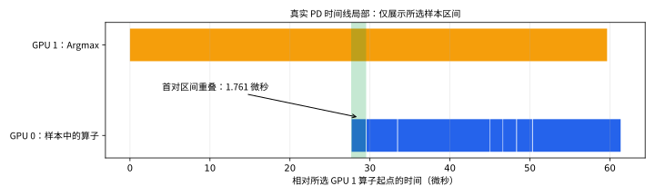

# 面试手册 05：从原始数据和时间线解释性能

[面试学习目录](README.md) · 上一篇：[故障定位](04_debug_cases_zh.md)

本篇围绕本项目已经保存的 CSV、Nsight 汇总和 SQLite 轨迹练习。你需要学会把“发现现象”“解释假设”和“已经验证的结论”分别说清楚。

不要求重新跑全部 GPU 实验。先用 `zyf1` 读取已有数据，算对数字、认清时间范围，再按需要采集新的 trace。

## 1. 先背性能回答的四句话

> 我先固定模型、输入、精度和调度配置，确认输出一致；再明确计时包括哪些阶段，用预热和重复测量得到原始点；随后借助时间线定位计算、传输或提交开销；最后通过只改变一个因素的对照验证，而不是仅凭某个 kernel 变少就宣称端到端加速。

四句话分别对应：工作量、计时、定位、验证。面试追问时，每句话都要能举出项目中的具体例子。

## 2. 一条命令重新算出面试数字

程序 [analyze_evidence.py](examples/analyze_evidence.py) 默认从仓库定位结果目录，不依赖当前 shell 的相对目录。

```bash
cd /home/users/zyf/zyf_llm.c/llm.c
conda run -p /home/miniconda3/envs/zyf1 python \
  doc/interview/examples/analyze_evidence.py
```

统计部分只用 Python 标准库：CSV、JSON、statistics。它不会加载 GPT-2，也不会启动 CUDA。

代表性输出：

```text
Eager n=7/7 full=8.253907 ms pruned=8.037522 ms reduction=2.622%
Graph n=7/7 full=5.314496 ms pruned=5.226693 ms reduction=1.652%
prefix=256 TTFT miss=4.056898 hit=1.540738 ms reduction=62.022% inputs=261->5
pd_graph.csv single=9.876151 pd=18.492698 ms ratio=1.872x transfer=7.018261 ms
首对 kernel 交集: 1761 ns = 1.761 us
已存整次 trace 重叠: 0.294998 ms；20 条配对样本不能替代完整轨迹。
```

完整运行记录见 [verified_output.txt](examples/verified_output.txt)。脚本中 `median`、`main`、`overlap_ns` 分别对应统计、实验分组与时间区间推导。

## 3. 先明确三组实验不是同一个负载

| 实验 | 输入与输出 | 对照方式 | 主要指标 |
| --- | --- | --- | --- |
| 采样行裁剪 | Prompt8/16/24/32，每请求输出4 | full/pruned，Eager/Graph分组 | 投影行数、激活容量、整批时间 |
| Prefix Cache | 公共前缀16/64/128/256，目标再接2个Token，输出4 | off/miss/hit | TTFT、命中块数、实际输入数 |
| PD | Prompt17/33/49，每请求输出8 | single/pd，Eager/Graph分组 | 整批时间、交接时间、传输量 |

共同条件与记录日期见 [结果说明](../../benchmark/results/task09_11/README.md)。模型初始化不计入正式时间；但不同 Benchmark 对请求构造、seed 和迁移的计时边界仍要分别核对。

**面试追问：能否用 Prefix 的最佳 TTFT 与 PD 总时间比，说明哪个方案更好？**

答案：不能。输入、并发、输出数和指标定义都不同，需要先统一要回答的问题和实验工作负载。

## 4. 从两列 total_ms 算改善，而不是看显示位数

核心统计逻辑可以独立写成：

```python
import statistics
baseline = statistics.median(baseline_total_ms)
optimized = statistics.median(optimized_total_ms)
reduction_percent = 100 * (baseline - optimized) / baseline
speedup = baseline / optimized
```

`reduction_percent` 是耗时下降百分比，`speedup` 是加速倍数。不要把耗时下降20%说成速度提高20%；例如10ms→8ms，耗时下降20%，速度比为1.25倍。

采样行 Graph 结果约1.65%时间下降，七个样本能支持本次固定实验的中位数描述，不足以证明所有场景都稳定获得同样收益。应该保留原始点，避免把小数位很多误认为统计确定性很高。

**检查点：** 先确认两份 CSV 各有7条正式记录，预热未混入；再检查实际启用的 full/pruned 和 Graph 开关。一次忘记传 `--full-logits`，就可能在比较两次相同实现。

## 5. 裁剪为什么减少激活，却增加了 H2D 元数据

原始 CSV 显示整批 H2D 元数据中位数从2944字节变为3008字节，增加64字节。这个变化与优化目标并不矛盾。

原因在 [sample_rows 上传](../../mini_vllm/cuda/gpt2_cuda_model_runner.cu#L1101)：新增了需要采样的行索引。固定负载一共16个输出，各一个int行号，增加 `16*4=64` 字节。

同时，LM head 从92行减少到16行，持久 logits 缓冲上限也缩小。一个局部流量增加可以换来另一项更大成本减少，必须按实际瓶颈评估总效果。

**30 秒回答：**

> 优化不是每个数字都只能下降。采样行裁剪增加了少量行索引元数据和 Gather，但减少了大量无用词表投影与 logits 容量。固定短负载中时间改善较小，所以我分别报告输入行数、缓冲区容量、元数据和端到端时间。

## 6. Prefix Cache 先验证工作量，再看 TTFT

目标 Prompt=S+2，输出4，off/miss需要 `S+5` 个实际输入位置；hit跳过S个公共前缀，因此只算5个。

```text
S=256：off/miss 输入261，hit输入5
但 hit 的新 Query 仍然要读取长历史的 KV
所以不能预期时间也按261/5倍下降
```

查 [prefix.csv](../../benchmark/results/task09_11/prefix.csv) 的 `scheduled_tokens` 和 `hit_blocks`，再看 `ttft_ms`。如果计数不符合预期，先排查功能或实验设置，不急着解释微小时间差。

seed和clear在目标计时外，意味着结果回答的是“公共缓存已存在时，这个目标请求节省多少”。如果要研究建立缓存的整体收益，应另测包含seed的一组请求，不能把当前hit时间直接作为总成本。

**口述句：** 我先用确定性的输入计数证明减少了工作，再用时间指标量化实际收益；两者相互支持，不能互相替代。

## 7. Nsight 时间线的四类轨道

打开 `.nsys-rep` 时，先确认进程、设备与时间范围，再找这些内容：

| 轨道 / 事件 | 能回答什么 | 常见误读 |
| --- | --- | --- |
| CPU CUDA API | 主机什么时候提交或等待 | API调用时间等于GPU kernel时间 |
| GPU Kernel | 设备上实际执行区间 | kernel间空白一定是Python慢 |
| GPU Memcpy | 传输方向与区间 | 函数名带Async就证明已与计算重叠 |
| Stream / CUDA Graph | 执行队列和重放组织 | 两个stream必然同时执行 |

先聚焦一个 `step` 或一次交接，不要从全进程总计直接推出单 Token 延迟。初始化、预热、基线和正式重复可能都包含在一次 profiler 运行里。

本项目没有为每个请求提供完整的 NVTX 语义标注。仅凭某个 kernel 名不能唯一识别它属于哪个请求；应结合引擎控制流、阶段输出和时间范围，无法确定时就明确说明证据边界。

## 8. 从 kernel 名回到源码调用点

| trace 中名称片段 | 源码入口 | 在模型链路中的作用 |
| --- | --- | --- |
| `embedding_kernel` | [forward 的 embedding](../../mini_vllm/cuda/gpt2_cuda_model_runner.cu#L1138) | Token和位置编码相加 |
| `ampere_*gemm*` / `cutlass*` | [matmul / logits_matmul](../../mini_vllm/cuda/gpt2_cuda_model_runner.cu#L985) | cuBLAS选择的矩阵实现 |
| `split_qkv_kernel` | [QKV拆分](../../mini_vllm/cuda/gpt2_cuda_model_runner.cu#L1173) | 连续QKV分成三份缓冲 |
| `write_kv_cache_kernel` | [写KV](../../mini_vllm/cuda/paged_attention.cu#L57) | 当前位置写物理页 |
| `paged_attention_kernel` | [分页Attention](../../mini_vllm/cuda/paged_attention.cu#L106) | 按页读取历史与归约 |
| `residual_layernorm_half2_kernel` | [融合kernel](../../mini_vllm/cuda/gpt2_cuda_model_runner.cu#L448) | 残差与LN双输出 |
| `gather_sample_rows_kernel` | [采样行Gather](../../mini_vllm/cuda/gpt2_cuda_model_runner.cu#L638) | 选需要投影的hidden行 |
| `argmax_kernel` | [采样调用](../../mini_vllm/cuda/gpt2_cuda_model_runner.cu#L1314) | 生成设备Token ID |

同一种 cuBLAS kernel 名可能服务多个不同 Linear 调用。只看到名称不足以反推出具体层或矩阵尺寸；需要调用位置、参数或更细的标记来区分。

## 9. 看懂一张真实双卡局部图

下图从仓库保存的配对样本绘制，横轴相对所选 GPU1 Argmax 起点，单位微秒：



蓝色为配对样本中 GPU0 的若干 kernel，橙色为同一段 GPU1 Argmax，绿色只标首对区间的交集。它展示真实事件片段，不是完整时间线，也不是一次请求的完整耗时。

第一条原始记录：

```text
GPU0 start = 6,989,264,441 ns
GPU0 end   = 6,989,266,202 ns
GPU1 start = 6,989,236,731 ns
GPU1 end   = 6,989,296,378 ns
```

交集公式：

```text
overlap = max(0, min(end0,end1) - max(start0,start1))
        = 6,989,266,202 - 6,989,264,441
        = 1,761 ns = 1.761 us
```

这能证明这两个kernel实际同时执行过一段时间。它不能证明两端整轮完全重叠，也不能证明比单卡更快。

**重新生成图：**

```bash
MPLCONFIGDIR=/tmp/zyf_interview_mpl \
  conda run -p /home/miniconda3/envs/zyf1 python \
  doc/interview/examples/analyze_evidence.py --svg /tmp/zyf_pd_overlap_excerpt.svg
```

画图额外使用本机已有 Matplotlib 和 Noto Sans CJK 字体；默认统计模式不依赖它们。SVG包含文字轮廓，查看已生成图不需要安装该字体。

## 10. 为什么总重叠不能把所有配对长度直接相加

假设设备0有两个重叠区间 `[0,10]`、`[5,15]`，设备1有 `[7,12]`：

```text
直接配对：与第一段交3，与第二段交5，合计8
真实重叠：设备0忙碌并集[0,15]与设备1[7,12]交，长度5
```

错误在于同一时刻被多个区间配对重复累计。正确流程是：各设备先合并区间，得到忙碌时间并集，再计算两个并集的交集。

[analyze_evidence.py](examples/analyze_evidence.py) 的 `merge` 与 `overlap_ns` 提供可运行教学实现；项目原始 [summarize_pd_overlap.py](../../scripts/summarize_pd_overlap.py#L21) 对完整SQLite使用同样原则。

**30 秒回答：**

> 并发提交只能说明主机发出了工作。证明设备重叠要看真实GPU时间区间，且每卡先合并忙碌区间，再求跨卡交集，避免重复累计。局部样本只能举例，整次结果必须用完整轨迹计算。

## 11. 从完整 SQLite 复核已有结果

本机已保存的文件：

```text
/tmp/zyf_pd_overlap_nodes.nsys-rep
/tmp/zyf_pd_overlap_nodes.sqlite
```

临时目录文件可能被清理，仓库不依赖它们才能打开学习文档。仓库长期保存的是CSV、JSON和哈希；若要在其他机器完整复核，需要重新采集或取得对应完整轨迹。

本机已有SQLite可用时：

```bash
conda run -p /home/miniconda3/envs/zyf1 python \
  scripts/summarize_pd_overlap.py \
  /tmp/zyf_pd_overlap_nodes.sqlite /tmp/zyf_interview_overlap_verified
```

该脚本只读打开SQLite，查询 kernel 的 start/end/device/stream/name。当前记录复算得到：

| 项目 | 数值 |
| --- | ---: |
| GPU0 kernel数 | 26,034 |
| GPU1 kernel数 | 18,009 |
| GPU0忙碌并集 | 126.615269 ms |
| GPU1忙碌并集 | 78.149528 ms |
| 两卡忙碌交集 | 0.294998 ms |

这个轨迹包含初始化、预热和多轮实验，不是单次正式PD请求。node级采集本身也有开销，不能把此重叠比例直接当作未采集时的性能比例。

本次重新读取原SQLite核对了结果和SHA256；这项操作没有重新运行GPU性能实验。

## 12. 如果需要重新采集，如何保持口径

先按 [任务11运行说明](../task_11_pd_disaggregation_zh.md) 构建并确认输出正确，再独立采集：

```bash
OMP_NUM_THREADS=8 nsys profile --trace=cuda --cuda-graph-trace=node \
  --sample=none --cpuctxsw=none --force-overwrite=true \
  -o /tmp/zyf_interview_pd_trace \
  ./benchmark_gpt2_pd_serving /tmp/zyf_interview_pd_profile.csv --cuda-graph

nsys export --type=sqlite --force-overwrite=true \
  --output=/tmp/zyf_interview_pd_trace.sqlite /tmp/zyf_interview_pd_trace.nsys-rep
```

`--cuda-graph-trace=node` 用于查看Graph内部节点。不同Nsight版本支持项可能不同；这些命令对应本机已有采集流程，运行前可用本机 `nsys profile --help` 核对选项。

使用新输出前缀，避免覆盖已有证据。正式速度对照另跑不带profiler的基准；profiler主要用于理解时间组成，不能把两种运行的时间混成同一组样本。

## 13. 汇总表中看似最大的项，不一定是稳态瓶颈

打开 [任务07 kernel统计](../../benchmark/results/gpt2_cuda_task07_fused_graph_nsys_cuda_gpu_kern_sum.csv)，可以看到 `float_to_half_kernel` 只执行1次，约0.876ms，也占一定比例。

它发生在参数初始化，不是每个生成step都要做。若据全进程占比优先优化这个kernel，却用排除初始化的TTFT/吞吐作为目标，就可能优化了不在目标计时里的工作。

同理，cuBLAS初始化、Graph首次捕获、模型权重上传与稳态replay应区分。先限定目标窗口，再看该窗口中谁占时间。

**面试追问：CUDA API表里 synchronize 占比高，是否同步函数本身计算很多？**

回答：它通常包含等待设备工作的时间，不能把等待时间与GPU计算时间当成独立串行成本简单相加。需要时间线的依赖关系来分解。

## 14. 怎样解释 PD 的负结果

Graph模式：单卡9.876151ms，PD18.492698ms，交接累计7.018261ms。两者差约8.616547ms，但不能把“差值−交接”严格归因于某一个模块。

原因是拆分后批形状、调度轮数、P/D等待和CPU工作都可能变化，部分计算又会重叠。差值可以引导检查，但不是精确的因果分摊。

已知交接统计包含：pinned staging申请释放、设备切换、逐页D2H/H2D及同步。它不是纯PCIe DMA时间，因此不能直接用 `payload/transfer_ms` 声称测出了链路峰值带宽。

**下一步实验设计，均为待验证方案：**

| 假设 | 只改什么 | 看什么结果 |
| --- | --- | --- |
| staging申请释放成本显著 | 复用同容量pinned缓冲 | transfer细分及整批时间 |
| 每轮线程创建有成本 | 使用持久P工作线程 | CPU提交与等待区间 |
| 同步迁移限制重叠 | 设计明确事件依赖的传输流水 | memcpy/计算真实交集与正确性 |
| 当前双卡资源分配不划算 | 两卡各跑完整请求作为对照 | 相同总负载的吞吐与延迟 |

面试回答可以提出这些方案，但需明确当前代码尚未实现和测量对应收益。

## 15. 一次性能分析要留下哪些证据

```text
问题：想改善TTFT、TPOT、总吞吐还是显存？
基线：源码版本、模型、输入、精度、预算、设备
正确性：相同输出与必要的数值检查
测量：初始化范围、warmup、重复数、原始点
定位：具体时间段、kernel/copy/API、源码调用点
结论：已证实什么、尚有哪些候选解释
```

不必把每个工具报告都贴进简历。主文保留最能证明结论的一张表，其他原始记录通过链接可追溯即可。

## 16. 闭卷题与参考答案

**题1：10ms降到8ms，是多少耗时降幅和加速倍数？**

答案：下降20%，加速1.25倍。

**题2：一次Graph replay有多个kernel，为什么CPU API少了而GPU工作不一定少？**

答案：图减少逐个提交的开销，内部算子仍执行同样数学工作；主机调用数与设备计算量不是同一指标。

**题3：H2D元数据多64字节，裁剪一定负优化吗？**

答案：不一定，需要与省掉的词表投影、缓冲容量和新增Gather成本一起测量。

**题4：配对样本合计0.1ms，能说整次重叠0.1ms吗？**

答案：不能，样本可能只是截取部分，也可能有重复区间。完整轨迹需先合并再求交。

**题5：Prefix的输入量261→5，为什么Decode不随之加速52倍？**

答案：Decode仍需读相同长历史KV，Prefix主要跳过公共前缀的重复前向，实际时间还含固定成本。

**题6：统计表某kernel占比最大，下一步一定优化它吗？**

答案：先确认它在目标计时窗口内、执行频率和可优化空间，再确认是否是端到端瓶颈。

**一分钟复述：**

> 我先按实验分组重算原始指标，避免混用不同负载。用采样行数量和缓存命中量证明工作确实减少，再看稳态时间；用Nsight把kernel、传输、同步和初始化区分开。PD的局部区间可以证明真实重叠，但全局重叠和整体加速需要另外的证据。最终报告包含负结果与测量边界，后续优化则以可检验的假设安排。
