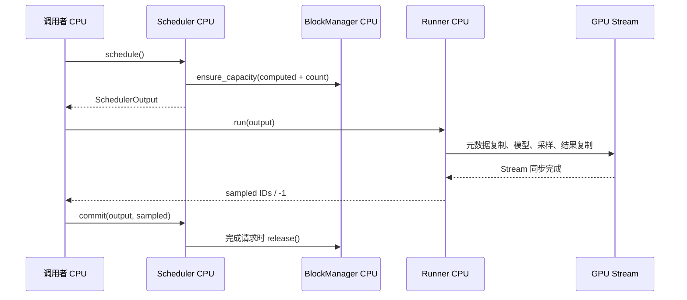

# 第 6 篇：两个请求从入队到回收的完整执行过程

[返回学习目录](README.md) · 下一篇：[PyTorch 与 C++/CUDA 逐段对照](07_pytorch_cuda_bridge_zh.md)

本篇回答一个完整问题：用户交给引擎两个 Prompt 以后，请求在哪一轮获得计算机会，Token 在哪里变成 Q/K/V，结果由谁写回，页面什么时候能够再次分配？

我们用**同一组请求、同一个页大小、固定四轮执行**串起已有实现。先看状态，再看元数据，最后进入 GPU。文中源码对应编写本篇时的项目实现；路径和行号可以点击，不要求背诵。外部 vLLM 的计数更新时机可能不同，参见 [固定版本源码对照](01_vllm_source_map_zh.md)。

## 1. 本篇怎么学，什么算过关

建议拆成三次学习，每次完成一件可以检查的事：

| 学习单元 | 阅读范围 | 要交出的结果 |
| --- | --- | --- |
| A：请求怎样前进 | 第 2—8 节 | 不运行程序，填出四轮 computed/total 表 |
| B：一轮怎样落到设备 | 第 9—14 节 | 写出第 3 轮的五行元数据和采样行 |
| C：结束、回收与复述 | 第 15—21 节 | 解释最后一个输出为何没有 KV，以及如何验证 |

这里的“完整”是指单卡生成主路径。Prefix Cache、CUDA Graph、融合先关闭，PD 留到后面的独立迁移小节。这样每个状态变化都能找到一个直接原因。

## 2. 先运行，再认识两种记录

学习程序：[request_walkthrough.cpp](examples/request_walkthrough.cpp)。它显式写出 `schedule → run → commit`，方便在三者之间观察；正式引擎把同样的调用顺序封装在 `GPT2CudaEngine::step` 中。

**CPU 控制面版本：** 真实运行 Sequence、BlockManager、Scheduler、Packed ModelInput；采样 ID 由教学规则生成，没有神经网络计算，也没有真实 KV 内容。

```bash
cd /home/users/zyf/zyf_llm.c/llm.c
c++ -std=c++17 -O0 -g -gdwarf-4 -I. \
  doc/interview/examples/request_walkthrough.cpp -o /tmp/zyf_request_walkthrough
/tmp/zyf_request_walkthrough
```

**CUDA 版本：** 同一个源码文件启用 `WALK_CUDA` 后，调用项目真实 CUDA Runner，执行一个两层、32 通道的微型 GPT-2。权重由固定公式构造，FP32、Eager，不下载预训练模型。

```bash
/usr/local/cuda/bin/nvcc -std=c++17 -O2 -lineinfo -arch=sm_86 \
  -DWALK_CUDA -I. doc/interview/examples/request_walkthrough.cpp \
  mini_vllm/cuda/gpt2_cuda_model_runner.cu \
  mini_vllm/cuda/paged_attention.cu -lcublas \
  -o /tmp/zyf_request_walkthrough_cuda
/tmp/zyf_request_walkthrough_cuda
```

这里的 `sm_86` 对应本机 RTX 3090；换设备时按实际架构调整。CPU 版本不依赖 CUDA。两个命令都不要加 `-DNDEBUG`，本例用断言检查手算结果。

已保存 [CPU 完整输出](examples/request_walkthrough_cpu.txt) 和 [CUDA 完整输出](examples/request_walkthrough_cuda.txt)。CUDA 版确实执行 GPU 算子；这些小模型记录用于理解执行流程，不是 GPT-2 124M 精度或性能测评。

## 3. 把所有前提写在纸上

| 参数 | 本篇取值 | 含义 |
| --- | --- | --- |
| 请求 A | ID=1，Prompt 为 1…17，生成 3 Token | Prompt 长 17 |
| 请求 B | ID=2，Prompt 为 20…38，生成 2 Token | Prompt 长 19 |
| 活跃请求上限 | 2 | Scheduler 最多保留两条 running 请求 |
| 每轮 Token 预算 | 16 | 所有请求本轮输入行数之和不超过 16 |
| KV 页大小 | 16 Token | 与正式 CUDA 页大小一致 |
| 物理页数量 | 4 | 页号初始依次为 0、1、2、3 |
| 上下文上限 | 32 | 每个请求最多处理 32 个输入位置 |
| EOS | 忽略 | 本例按输出数量结束，保证四轮主线稳定 |
| Prefix / Graph / 融合 | 关闭 | 本篇只追普通执行分支 |

请求 A 的最大实际输入位置数是 `17+3−1=19`，B 是 `19+2−1=20`，均未超过 32。不要把最后输出的 ID 也算作一定要再运行一次模型的输入。

CPU 教学输出为 A 的 `[11,12,13]`、B 的 `[21,22]`；GPU 微型模型在保存的运行中输出 A 的 `[4,25,0]`、B 的 `[21,21]`。**本篇的调度表只依赖长度和终止条件，不依赖这几个 ID 的具体数值。**

## 4. 五个对象分别持有什么

| 对象 | 主要数据 | 数据位置 | 生命周期 |
| --- | --- | --- | --- |
| `Sequence` | Token IDs、computed、状态、逻辑页表 | CPU | 一个请求 |
| `BlockManager` | 空闲页、引用计数、分配记录 | CPU | 整个引擎 |
| `SchedulerOutput` | 本轮选中谁、各算几行 | CPU | 一次调度 |
| `ModelInput` | 每行 ID、position、context、slot、页表 | CPU；部分上传 GPU | 一次 Runner 调用 |
| `GPT2CudaModelRunner` | 权重、真实 K/V、激活、设备元数据 | 主要在 GPU | 整个引擎 |

`Sequence::block_table()` 是整数数组。它只描述“逻辑第几页对应物理第几页”，不存 K/V 浮点数。`BlockManager::release()` 也不会直接调用 `cudaFree`；设备 KV 池是 Runner 持有的长期分配。

把它与你熟悉的 PyTorch 对应：模型参数类似长期持有的 Module 权重；激活类似 forward 临时工作空间；Sequence 和 Scheduler 是包在 forward 外面的请求管理层。

## 5. 三个计数关系，先解释再记忆

源码/记录：[mini_vllm/sequence.hpp，第 39—64 行](../../mini_vllm/sequence.hpp#L39)。

```cpp
    const std::vector<int>& token_ids() const { return token_ids_; }
    std::size_t num_tokens() const { return token_ids_.size(); }
    std::size_t num_prompt_tokens() const { return num_prompt_tokens_; }
    std::size_t num_completion_tokens() const {
        return token_ids_.size() - num_prompt_tokens_;
    }
    std::size_t num_computed_tokens() const { return num_computed_tokens_; }
    std::size_t pending_tokens() const {
        return token_ids_.size() - num_computed_tokens_;
    }
    bool is_prefill() const { return num_computed_tokens_ < num_prompt_tokens_; }
    bool is_finished() const { return status_ == SequenceStatus::Finished; }

    void mark_computed(std::size_t count) {
        if (count > pending_tokens()) {
            throw std::logic_error("cannot compute tokens that are not present in the sequence");
        }
        num_computed_tokens_ += count;
    }

    void append_token(int token_id) {
        if (num_computed_tokens_ != token_ids_.size()) {
            throw std::logic_error("a sampled token can only follow fully computed input tokens");
        }
        token_ids_.push_back(token_id);
    }
```

`num_tokens()` 是当前已知 ID 的数量，包括 Prompt 和已生成 ID。`num_computed_tokens()` 表示已经完成模型处理的输入前缀长度。两者差值是下一步尚需处理的输入数量。

`mark_computed(count)` 只推进计数；它不会执行 Attention。调用者必须先让对应计算完成。`append_token` 只添加一个新 ID；它不会创建这个 ID 的 K/V。

一次正常采样附近的状态是：

```text
run 前：computed=c，total=c+n，pending=n
run 返回：模型已处理这 n 行，但 CPU 的 computed 仍是 c
mark_computed(n)：computed=c+n，total=c+n，pending=0
append_token(y)：computed=c+n，total=c+n+1，pending=1
```

运行状态和计算阶段也不同：`Running` 表示已经进入活跃队列；`is_prefill()` 看 computed 是否到达 Prompt 末尾。B 在第 2 轮结束时是 Running，同时仍处在 Prefill。

## 6. 从正式 Engine.step 找到总调用点

源码/记录：[mini_vllm/cuda/gpt2_cuda_engine.hpp，第 75—97 行](../../mini_vllm/cuda/gpt2_cuda_engine.hpp#L75)。

```cpp
    CudaEngineStepResult step() {
        if (scheduler_.is_finished()) {
            throw std::logic_error("cannot step a finished CUDA engine");
        }
        SchedulerOutput output = scheduler_.schedule();
        if (output.items.empty()) {
            throw std::runtime_error(
                "CUDA scheduler made no progress; KV cache may be exhausted");
        }

        CudaEngineStepResult result;
        result.num_batched_tokens = output.num_batched_tokens;
        for (const ScheduledItem& item : output.items) {
            result.request_ids.push_back(item.sequence->request_id());
            result.phases.push_back(item.phase);
            result.scheduled_token_counts.push_back(
                item.num_scheduled_tokens);
        }
        result.sampled_token_ids = model_runner_.run(output);
        result.num_micro_batches =
            model_runner_.last_model_inputs().size();
        scheduler_.commit(output, result.sampled_token_ids);
        return result;
```

按因果顺序读这段：

1. Scheduler 先决定本轮输入范围并确保页容量。没有可执行项时，Engine 报告无进展。
2. Runner 接收这份计划，构造元数据，执行模型，并返回按 scheduled item 排列的采样标记。
3. `commit` 把本轮工作记入请求；必要时追加输出、结束请求、归还页。

`CudaEngineStepResult` 是本轮对外报告。`num_batched_tokens` 不是输出 Token 数；`num_micro_batches` 在当前 CUDA Packed 路径里通常是 1，不是 Token 数，也不是 kernel 数。



## 7. 入队与第 1 轮：16 行输入，零行采样

初始 A、B 都是 Waiting，computed=0，页表为空，free=4。入队只让 Scheduler 知道请求存在，并不意味着模型已经处理 Prompt。

源码/记录：[mini_vllm/scheduler.hpp，第 69—82 行](../../mini_vllm/scheduler.hpp#L69)。

```cpp
        // Admit new requests with the token budget left by active requests.
        while (!waiting_.empty() &&
               running_.size() < config_.max_num_sequences &&
               output.items.size() < config_.max_num_sequences &&
               output.num_batched_tokens < config_.max_num_batched_tokens) {
            const auto sequence = waiting_.front();
            if (!try_schedule(sequence, output)) {
                break; // FCFS admission: do not bypass a blocked head request.
            }
            waiting_.pop_front();
            sequence->set_status(SequenceStatus::Running);
            running_.push_back(sequence);
        }
        return output;
```

第 1 轮先看等待队列头 A。A 有 17 个待处理 Token，预算只有 16，因此只安排前 16 个。A 需要一页，取得页 0；预算用完，B 继续等待。

源码/记录：[mini_vllm/scheduler.hpp，第 131—143 行](../../mini_vllm/scheduler.hpp#L131)。

```cpp
        const std::size_t budget =
            config_.max_num_batched_tokens - output.num_batched_tokens;
        const std::size_t count = std::min(sequence->pending_tokens(), budget);
        const std::size_t target = sequence->num_computed_tokens() + count;
        if (!block_manager_.ensure_capacity(*sequence, target)) {
            return false;
        }
        output.items.push_back(
            {sequence, sequence->is_prefill() ? ExecutionPhase::Prefill
                                              : ExecutionPhase::Decode,
             count});
        output.num_batched_tokens += count;
        return true;
```

这一段的 `target=computed+count` 是本轮执行后需要容纳的输入前缀长度。本例不会在 A 入队时预先分配全部未来输出所需的页。

```text
本轮 item：A / Prefill / count=16
positions：[0,1,...,15]
context_lengths：[1,2,...,16]
slot_mapping：[0,1,...,15]
query_start_locations：[0,16]
sample_rows：[]
N=16，R=0，free=3
```

为什么 R=0？`0+16 != 17`，Prompt 还有最后一个位置未处理，不能用前一个位置的预测冒充完整 Prompt 的首输出。

CPU 替身返回 `[-1]`；真实 CUDA Runner 同样返回 `[-1]`，但 GPU 已经计算这 16 行在每一层的 K/V。`-1` 是“此 item 本轮没有输出”的 CPU 协议标记，不是一个应喂给模型的 Token ID。

第 1 轮提交后 A：computed=16,total=17,pending=1；B 仍是 0/19。此时 A 虽然只有一个 pending Token，仍是 Prefill，因为 computed 尚未到达 Prompt 长度 17。

## 8. 先看四轮总表，再逐轮解释

表里的 `c/t` 表示 `computed/total`；所有状态是 **commit 完成后** 的值。`free` 的左右数字是调度后和提交后的空闲页数。

| 轮次 | A 本轮处理 | B 本轮处理 | N / R | A 提交后 c/t | B 提交后 c/t | free |
| --- | --- | --- | --- | --- | --- | --- |
| 1 | Prompt 位置 0…15，共 16 行 | 等待 | 16 / 0 | 16/17 | 0/19 | 3 → 3 |
| 2 | Prompt 位置 16，共 1 行 | Prompt 位置 0…14，共 15 行 | 16 / 1 | 17/18 | 15/19 | 1 → 1 |
| 3 | 上轮首输出，位置 17 | Prompt 位置 15…18，共 4 行 | 5 / 2 | 18/19 | 19/20 | 0 → 0 |
| 4 | 上轮第二输出，位置 18 | 上轮首输出，位置 19 | 2 / 2 | 19/20，Finished | 20/21，Finished | 0 → 4 |

总共处理 `16+16+5+2=39` 行，也等于 A 的 19 行加 B 的 20 行。总共生成 `0+1+2+2=5` 个输出。**工作量表与请求末态应相互核对。**

## 9. 第 2 轮：A 跨页，B 在剩余预算中进入

活跃请求先推进。A 的 computed=16，本轮处理逻辑位置 16，所需容量为 17。`ceil(17/16)=2`，因此再分配页 1，A 页表成为 `[0,1]`。

剩余预算是 `16−1=15`。B 从等待队列进入 Running，先分配页 2，处理它的前 15 个 Prompt Token。B 的完整 Prompt 长 19，但本轮还不需要第二页。

| Packed 行 | 请求 | 逻辑 position | context | 物理 slot | 能否作为采样行 |
| --- | --- | --- | --- | --- | --- |
| 0 | A | 16 | 17 | 16 | 可以，A 的所有当前输入将完成 |
| 1…15 | B | 0…14 | 1…15 | 32…46 | 不可以，B 还剩 4 个 Prompt Token |

`query_start_locations=[0,1,16]`；A 占 `[0,1)`，B 占 `[1,16)`。`sample_rows=[0]`，不是最后一个 Packed 行 `[15]`。

源码/记录：[mini_vllm/cuda/gpt2_cuda_model_runner.cu，第 756—775 行](../../mini_vllm/cuda/gpt2_cuda_model_runner.cu#L756)。

```cpp
        std::vector<int> sampled(output.items.size(), -1);
        last_model_inputs_.clear();
        last_host_to_device_bytes_ = 0;
        ModelInput input = prepare_packed_model_input(
            output, block_manager_, max_context_length_,
            max_blocks_per_sequence_, num_pages_);
        last_logit_token_indices_.clear();
        if (config_.enable_sample_row_pruning) {
            for (std::size_t i = 0; i < output.items.size(); ++i) {
                const auto& item = output.items[i];
                if (item.sequence->num_computed_tokens() + item.num_scheduled_tokens ==
                    item.sequence->num_tokens()) {
                    last_logit_token_indices_.push_back(static_cast<int>(
                        input.query_start_locations[i + 1] - 1));
                }
            }
        } else {
            last_logit_token_indices_.resize(input.batch_size());
            std::iota(last_logit_token_indices_.begin(), last_logit_token_indices_.end(), 0);
        }
```

这里比较的是“当前 computed + 本轮 count”与“当前已知 ID 总数”。只有相等，才选择该请求本轮区间的最后一行。GPU 返回一个真正的采样结果，Runner 再恢复成长度为 2 的 item 结果，例如 CUDA 实测 `[4,-1]`。

提交时 A 先变成 17/17，再追加首输出变成 17/18。B 只推进到 15/19。不要把 Runner 返回的数组长度 2 与设备 LM Head 的行数 R=1 混为一谈。

## 10. 第 3 轮：完整展开五行 ModelInput

这是最值得手算的一轮。A 是 Decode，处理位置 17；B 仍是 Prefill，处理位置 15、16、17、18。

B 需要容量 19，因此取得页 3，页表成为 `[2,3]`。四个页全部有主。

源码/记录：[mini_vllm/model_input.hpp，第 62—91 行](../../mini_vllm/model_input.hpp#L62)。

```cpp
        for (std::size_t offset = 0;
             offset < item.num_scheduled_tokens; ++offset) {
            const std::size_t position =
                sequence.num_computed_tokens() + offset;
            if (position >= sequence.num_tokens() ||
                position >= max_context_length) {
                throw std::out_of_range(
                    "scheduled token exceeds sequence or context capacity");
            }
            const int physical_block =
                block_manager.block_id_for_token(sequence, position);
            if (physical_block < 0 ||
                static_cast<std::size_t>(physical_block) >= num_kv_pages) {
                throw std::out_of_range(
                    "sequence references an invalid physical KV block");
            }

            input.token_ids.push_back(sequence.token_ids()[position]);
            input.positions.push_back(model_input_checked_int(
                position, "token position is too large"));
            input.context_lengths.push_back(model_input_checked_int(
                position + 1, "context length is too large"));
            const std::size_t physical_slot =
                static_cast<std::size_t>(physical_block) *
                    block_manager.block_size() +
                block_manager.slot_for_token(position);
            input.slot_mapping.push_back(model_input_checked_int(
                physical_slot, "physical KV slot is too large"));
            input.request_ids.push_back(sequence.request_id());
            input.scheduled_item_indices.push_back(item_index);
```

`position` 从各自请求的 computed 开始累加，不从 Packed 行号开始。`context=position+1` 是当前 query 可以读取的该请求 KV 前缀长度。

| row | item_index | request_id | position | context | logical_page | physical_page | offset | slot |
| --- | --- | --- | --- | --- | --- | --- | --- | --- |
| 0 | 0 | 1 / A | 17 | 18 | 1 | 1 | 1 | 17 |
| 1 | 1 | 2 / B | 15 | 16 | 0 | 2 | 15 | 47 |
| 2 | 1 | 2 / B | 16 | 17 | 1 | 3 | 0 | 48 |
| 3 | 1 | 2 / B | 17 | 18 | 1 | 3 | 1 | 49 |
| 4 | 1 | 2 / B | 18 | 19 | 1 | 3 | 2 | 50 |

这一轮的数组必须能从表中读出来：

```text
positions             = [17,15,16,17,18]
context_lengths       = [18,16,17,18,19]
slot_mapping          = [17,47,48,49,50]
scheduled_item_indices= [0,1,1,1,1]
request_ids           = [1,2,2,2,2]
query_start_locations = [0,1,5]
sample_rows           = [0,4]
block_tables_flat     = [0,1, 2,3, 2,3, 2,3, 2,3]
```

`block_tables_flat` 有 `N×max_blocks=5×2=10` 个整数。当前实现为每个 Token 行复制对应请求页表，B 的页表重复四次。它不是每个请求只存一份的压缩形式。

源码/记录：[mini_vllm/model_input.hpp，第 93—107 行](../../mini_vllm/model_input.hpp#L93)。

```cpp
            const std::size_t row_start = input.block_tables.size();
            input.block_tables.resize(
                row_start + max_blocks_per_sequence, -1);
            std::copy(
                sequence.block_table().begin(),
                sequence.block_table().end(),
                input.block_tables.begin() +
                    static_cast<std::ptrdiff_t>(row_start));
        }
    }
    input.query_start_locations.push_back(input.batch_size());
    if (input.batch_size() == 0 ||
        input.batch_size() != output.num_batched_tokens) {
        throw std::logic_error(
            "packed ModelInput does not match scheduled token count");
```

这解释了为什么 CUDA kernel 的 `request * max_blocks_per_sequence` 在 Packed 路径中实际按 Token 行选择页表。名字沿用旧单 Token Batch 接口，判断语义要看生产者。

本轮 GPU 的输入 ID 是 `[4,35,36,37,38]`；CPU 教学版是 `[11,35,36,37,38]`。第 0 行来自 A 前一轮生成的 ID，其余来自 B 已知 Prompt。

## 11. ModelInput 中哪些字段真正上传 GPU

源码/记录：[mini_vllm/cuda/gpt2_cuda_model_runner.cu，第 1091—1106 行](../../mini_vllm/cuda/gpt2_cuda_model_runner.cu#L1091)。

```cpp
        copy_metadata(token_ids_, input.token_ids, "copy token ids");
        copy_metadata(positions_, input.positions, "copy positions");
        copy_metadata(
            context_lengths_, input.context_lengths,
            "copy context lengths");
        copy_metadata(
            slot_mapping_, input.slot_mapping, "copy slot mapping");
        copy_metadata(
            block_tables_, input.block_tables, "copy block tables");

        const int num_logit_rows = static_cast<int>(last_logit_token_indices_.size());
        if (config_.enable_sample_row_pruning && num_logit_rows > 0) {
            copy_metadata(sample_rows_, last_logit_token_indices_, "copy sample rows");
        }
        // Grid/GEMM 随输入行数和采样行数变化；行索引本身在图外更新。
        const auto graph_key = std::make_pair(batch_size, num_logit_rows);
```

上传的基础字段是 Token IDs、positions、context lengths、slot mapping、展开页表。开启采样行裁剪且 R>0 时，再上传 sample rows。

`request_ids`、`scheduled_item_indices`、`query_start_locations` 在当前实现中用于 CPU 组织和恢复结果；不能看到 ModelInput 有这个字段，就认为 GPU 一定读取它。

本例页表每行宽度是 2，int 占 4 字节，因此每轮元数据字节数为：

```text
bytes = 4 × (4N + 2N + R)
第1轮：4 × (64+32+0) = 384
第2轮：4 × (64+32+1) = 388
第3轮：4 × (20+10+2) = 128
第4轮：4 × ( 8+ 4+2) = 56
```

这些数与 CUDA 日志一致。这里统计的是本轮元数据 H2D，不包括初始权重上传、KV 池初始化，也不包括输出 ID 的 D2H。

## 12. 第 3 轮在 GPU 上到底计算什么

本例 CUDA 模型 `L=2,C=32,H=4,D=8,Vp=64`。N=5、R=2。按正常非融合路径，每层对全部五行执行：

```text
Token/Position Embedding       [5,32]
LayerNorm → QKV Projection     [5,96]
Split Q/K/V                   各 [5,4,8]
按 slot 写入该层 K/V          写入 5 个逻辑 Token 对应的槽
Paged Attention               [5,4,8] → [5,32]
Attention 输出投影 + Residual [5,32]
LayerNorm → MLP                [5,128] → [5,32]
Residual                      [5,32]
```

最后一层后执行 final LayerNorm，选择 `[0,4]` 两行得到 `[2,32]`，LM Head 输出 `[2,64]`，Argmax 得到两个 ID。

源码/记录：[mini_vllm/cuda/gpt2_cuda_model_runner.cu，第 1166—1188 行](../../mini_vllm/cuda/gpt2_cuda_model_runner.cu#L1166)。

```cpp
            matmul(
                qkv_.get<T>(), normalized_.get<T>(),
                parameters_view.qkvw +
                    static_cast<std::size_t>(layer) * 3 * channels * channels,
                parameters_view.qkvb +
                    static_cast<std::size_t>(layer) * 3 * channels,
                batch_size, channels, 3 * channels);
            split_qkv_kernel<T><<<
                blocks_for(channel_elements), kThreads, 0, stream_.get()>>>(
                qkv_.get<T>(), query_.get<T>(), key_.get<T>(), value_.get<T>(),
                batch_size, channels);
            check_last_kernel("split_qkv_kernel");

            check_cuda(
                paged_attention_decode(
                    query_.get<T>(), key_.get<T>(), value_.get<T>(),
                    key_cache_.get<T>(), value_cache_.get<T>(),
                    block_tables_.get(), context_lengths_.get(),
                    slot_mapping_.get(), attention_.get<T>(), batch_size,
                    num_pages_, config_.num_layers, layer,
                    config_.num_heads, channels / config_.num_heads,
                    max_blocks_per_sequence_, max_context_length_,
                    stream_.get()),
```

`paged_attention_decode` 的函数名有 decode，但调用参数 `batch_size` 是 N。当前 Packed Prefill 也复用这个逐 query 的分页 Attention 实现，不代表它使用了生产 vLLM 的高性能 Prefill kernel。

每一层都先写本轮五行的新 K/V，再启动读取 kernel。同一 stream 上两个 kernel 的提交顺序保证写入完成后才读取。B 的位置 15 即使物理池中已写入位置 16—18，也只能读取前 16 个位置，因为 context=16。

这里区分两种依赖：同层的 K/V 来自进入这一层时已得到的各行激活；跨层则由上一层 Attention 和 MLP 的输出决定。不能因为一次写入多行，就推断模型允许看到未来 Token。

## 13. 为什么 run 返回时才可以 commit

源码/记录：[mini_vllm/cuda/gpt2_cuda_model_runner.cu，第 1342—1352 行](../../mini_vllm/cuda/gpt2_cuda_model_runner.cu#L1342)。

```cpp
        std::vector<int> sampled(num_logit_rows);
        if (num_logit_rows > 0) check_cuda(
            cudaMemcpyAsync(
                sampled.data(), sampled_token_ids_.get(),
                sampled.size() * sizeof(int), cudaMemcpyDeviceToHost,
                stream_.get()),
            "copy sampled token ids");
        check_cuda(
            cudaStreamSynchronize(stream_.get()),
            "finish CUDA GPT-2 micro batch");
        return sampled;
```

GPU 的 kernel launch 和 `cudaMemcpyAsync` 是提交操作。`cudaStreamSynchronize` 才让当前函数等待这条 stream 的工作完成，再把 CPU vector 返回给调用者。

R=0 时没有输出 ID 需要复制，但同步仍会执行，因为前面的模型计算和 KV 写入依然需要完成。若这一轮只因为“没有采样”就提前返回并提交 computed，下一轮可能把未完成的 KV 当作可用输入。

当前代码有这个同步边界，因此 `commit` 能把完成的 GPU 工作记为 computed。以后若设计异步提交，需要重新设计完成通知和生命周期；不能单独删除同步后沿用原来的状态约定。

## 14. 设备采样结果怎样回到正确请求

源码/记录：[mini_vllm/cuda/gpt2_cuda_model_runner.cu，第 782—797 行](../../mini_vllm/cuda/gpt2_cuda_model_runner.cu#L782)。

```cpp
        std::size_t sample_index = 0;
        for (std::size_t item_index = 0;
             item_index < output.items.size(); ++item_index) {
            const ScheduledItem& item = output.items[item_index];
            const Sequence& sequence = *item.sequence;
            if (sequence.num_computed_tokens() +
                    item.num_scheduled_tokens ==
                sequence.num_tokens()) {
                const std::size_t final_token =
                    input.query_start_locations[item_index + 1] - 1;
                sampled[item_index] = token_samples[
                    config_.enable_sample_row_pruning ? sample_index++ : final_token];
            }
        }
        last_model_inputs_.push_back(std::move(input));
        return sampled;
```

第 3 轮，设备 `token_samples` 只有两项。启用裁剪时，`sample_index` 按有资格采样的 item 递增；它对应压缩后的 R 行。`final_token` 对应裁剪前 N 行中的位置。

如果某轮 A 完成输入、B 只是部分 Prefill，那么 R=1，返回给 Scheduler 的结果仍为 `[A的输出,-1]`。这一步保留了“一个 scheduled item 一个标记”的协议。

因此有三个不同的索引：请求在 output 中的 item index、请求末尾在 Packed 输入中的 final row、压缩结果中的 sample index。第 3 轮 B 分别是 `1、4、1`。只背“取最后一行”无法说明这三者如何对应。

## 15. 第 4 轮：最后输出产生后，为什么还剩 pending=1

第 4 轮 A 处理位置 18，B 处理位置 19。它们输出各自的最后一个 Token 后结束。

源码/记录：[mini_vllm/scheduler.hpp，第 93—113 行](../../mini_vllm/scheduler.hpp#L93)。

```cpp
        for (std::size_t i = 0; i < output.items.size(); ++i) {
            const ScheduledItem& item = output.items[i];
            Sequence& sequence = *item.sequence;
            sequence.mark_computed(item.num_scheduled_tokens);
            block_manager_.cache_computed_prefix_blocks(sequence);
            if (sequence.pending_tokens() != 0) {
                if (sampled_token_ids[i] != -1) {
                    throw std::logic_error("partial prefill must not produce a sampled token");
                }
                continue;
            }
            const int sampled_token = sampled_token_ids[i];
            if (sampled_token < 0) {
                throw std::logic_error("completed model input requires a sampled token");
            }
            sequence.append_token(sampled_token);
            if (sequence.should_finish_after(sampled_token)) {
                sequence.set_status(SequenceStatus::Finished);
                block_manager_.release(sequence);
                finished.push_back(item.sequence);
            }
```

顺序是先增加 computed，再追加输出，之后判断结束。A 最终 19/20，B 最终 20/21；最后一个输出 ID 只需要交给调用者，没有继续预测的需求，所以不再运行模型为它建立 KV。

`pending=1` 是计数差值，不等于“这个请求必须继续运行”。是否继续调度还要看 Finished 状态，以及是否已从 running 队列移除。

`phase_by_counter=Decode` 也不表示 Finished 请求仍在执行 Decode。学习日志有意同时打印这些字段，帮助你分清状态标签和计数推导值。

## 16. 页面回收究竟回收了什么

源码/记录：[mini_vllm/block_manager.hpp，第 189—201 行](../../mini_vllm/block_manager.hpp#L189)。

```cpp
        for (auto it = sequence.block_table().rbegin();
             it != sequence.block_table().rend(); ++it) {
            Block& block = blocks_.at(static_cast<std::size_t>(*it));
            if (block.ref_count == 0) {
                throw std::logic_error("block reference count underflow");
            }
            --block.ref_count;
            if (block.ref_count == 0) {
                free_block_ids_.push_back(block.id);
            }
        }
        sequence.block_table().clear();
    }
```

关闭 Prefix Cache 时，每个分配页只有请求持有的引用。A 页表 `[0,1]` 逆序归还，空闲队列得到 `[1,0]`；B 页表 `[2,3]` 逆序归还，接着变为 `[1,0,3,2]`。

程序末尾用一个独立容量探针申请 17 个 Token 的空间，获得 `[1,0]`。这说明逻辑页 0、1 可以映射到物理页 1、0，分配算法不承诺物理地址递增。

GPU KV 池里的旧浮点值并不会因此逐个清零。安全复用依赖于：新请求先写入其有效位置，读取时使用新请求的页表和 context，仅访问已初始化的有效前缀。只验证 free=4 可以说明容量归还，还不能单独证明数值复用正确；后者需要 [测试篇](08_tests_as_spec_zh.md) 的页复用与 dense 对照。

## 17. 断点应该下在哪里

用 CPU 版练习即可观察控制面；普通 GDB 在这里不会显示 GPU kernel 内线程的实际执行。

```bash
gdb /tmp/zyf_request_walkthrough
```

```gdb
set pagination off
break mini_vllm/scheduler.hpp:134
break mini_vllm/model_input.hpp:64
break mini_vllm/scheduler.hpp:96
run
```

| 断点 | 先检查什么 | 为什么看这里 |
| --- | --- | --- |
| `try_schedule` 的 target 计算 | `budget`、`count`、Sequence 计数 | 判断调度范围是否已错 |
| `prepare_packed_model_input` 的 position | `offset`、item_index、computed | 找到逻辑位置到 Packed 行的起点 |
| `commit` 的 mark_computed | 本轮 count、采样标记、提交前计数 | 区分模型结果与记账错误 |
| `BlockManager::release` | 页表、ref_count、空闲队列 | 确认完成后容量归还 |

可以先用日志找到第 3 轮，再单步对应函数。观察 STL 私有成员时，在 GDB 中看 `sequence.num_computed_tokens_` 等字段通常比调用优化后的内联 accessor 更直接；如果名称无法解析，先 `info locals` 确认当前栈帧。

## 18. 主线掌握后，怎样接到 Prefix 与 PD

这两个场景分别练，不叠加进四轮主线。

**Prefix 场景：** 新请求 Prompt 长 18，已存在相同前 16 Token 的可复用完整页。`apply_prefix_cache` 让它带着一页共享映射和 computed=16 进入本轮，此时只需处理位置 16、17。它们是 Prompt 的最后两行，产生首输出后成为 computed=18,total=19。需要核对共享内容的身份和引用计数，不能只复制一个整数 16。

**PD 场景：** P 端处理 17 个 Prompt Token 并产生首输出 y0。迁移已计算前缀覆盖的 KV 页，D 端恢复 computed=17、IDs 长度=18。D 的第一轮输入是 y0，位置 17。两端物理页号可不同，恢复后的逻辑顺序必须一致。完整交接代码见 [任务 11](../task_11_pd_disaggregation_zh.md)。

两个场景都会“带已有 computed 进入后续执行”，但原因不同：前者是共享已有缓存，后者是跨设备迁移请求执行状态。

## 19. 面试时的一分钟回答

> 我把一次 step 分成调度、设备执行和提交。调度器根据 pending 和 Token 预算决定每个请求本轮处理的范围，并为 computed 加本轮 count 确保页容量。Runner 将各请求的新 Token 拼成 Packed 输入，为每行生成逻辑位置、上下文长度、物理槽和页表。GPU 对全部输入行执行模型及 KV 写入，只对完成当前输入的请求末行做 LM Head 和采样。结果同步回 CPU 后，Scheduler 才更新 computed、追加输出并回收完成请求的页面。最后一个输出无需再次输入模型，所以请求结束时 total 可以比 computed 大一。

这段回答要配一个例子：第 3 轮 N=5、R=2，B 的 item index=1、final row=4。面试官追问时，能从例子回到对应源码。

## 20. 闭卷题：每题都要讲原因

**题 1：第 1 轮没有输出，可以跳过 GPU 吗？**

不能。该轮必须计算 A 前 16 个 Prompt Token 的多层 K/V，后续位置会读取它们。R=0 只使末尾的 Gather/LM Head/Argmax 被跳过；主体模型仍运行。

**题 2：第 2 轮 B 已进入 Running，为什么第 3 轮还是 Prefill？**

Running 描述队列归属。B 提交后的 computed=15，小于 Prompt 长度 19，仍有四个 Prompt Token 尚未计算。计算阶段由进度推导。

**题 3：如果把第 3 轮 B 的 context 都写成 19，会发生什么？**

B 的位置 15、16、17 将能读取各自的未来 K/V，违反因果约束。数组长度完全正确也无法阻止这个语义错误，所以需要逐行 context 检查或未来扰动对照。

**题 4：为什么第 2 轮元数据比第 1 轮多 4 字节？**

两轮 N 都是 16、页表宽度都是 2，基础元数据相同。第 2 轮 R=1，裁剪路径多上传一个 int 型采样行索引；第 1 轮 R=0，没有该复制。

**题 5：把每轮预算改成 8，四轮表还能直接使用吗？**

不能。每轮输入范围、B 的接纳时间和采样轮次可能改变，应重新运行或手推。对本例禁用 Prefix 且按固定输出数结束的条件，两个请求最终实际计算的输入行数仍为 19 和 20。

**题 6：完成后 free=4 能证明不存在 CUDA 越界吗？**

不能。它只验证 CPU 页容量归还。GPU 越界需要设备内存检查，数值正确性需要输出或中间结果对照；不同证据回答不同问题。

## 21. 本篇证据与下一步

本轮实际编译运行了 CPU 控制面版、CUDA 微型模型版；四轮输入数量、采样行、计数和页面回收均通过学习程序中的断言。没有在本篇重跑完整 124M 模型的性能矩阵。

完成后请自己留下三样东西：四轮状态表、第 3 轮五行元数据、一分钟口述。随后进入 [第 7 篇](07_pytorch_cuda_bridge_zh.md)，把五行中的数学操作翻译成你熟悉的 PyTorch。
